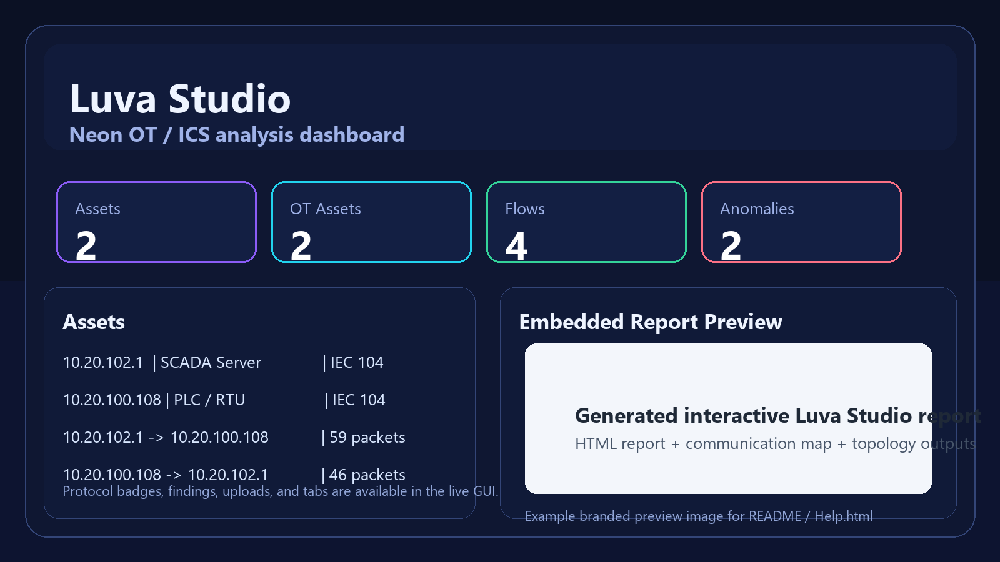

# Luva Studio

<p align="center">
  
</p>

<p align="center">
  <strong>Luva Studio</strong> is a polished local OT / ICS packet-analysis workstation that turns offline PCAP captures into readable dashboards, inventories, flows, findings, topology views, and interactive HTML reports.
</p>

<p align="center">
  <a href="https://github.com/Ayman-Elbanhawy/LuvaStudio">GitHub</a> •
  <a href="https://softwaremile.com">Website</a> •
  <a href="mailto:Github@Softwaremile.com">Support</a>
</p>

---

## Overview

Luva Studio wraps the Luva passive analyzer with a friendlier local experience for Windows users. Instead of dealing with a raw CLI first, you launch the app, open the local GUI, drag in a capture, run analysis, and review results in one place.

### What Luva Studio gives you

- Dark neon local dashboard UI
- Drag-and-drop PCAP / PCAPNG / GZ capture upload
- OT / ICS protocol badges and summaries
- Asset inventory and flow review tables
- Audit findings and threat hints
- Communication-map and topology outputs
- Embedded HTML report viewing in the same interface
- Automatic dependency repair from `StartMe.bat`
- Fully offline capture analysis workflow

---

## Screenshots

### Luva Studio dashboard

<p align="center">
  
</p>

### Built-in Luva report example

<p align="center">
  
</p>

---

## How it works

Luva Studio uses the Luva analyzer engine under the hood.

### Workflow

1. Launch `StartMe.bat`
2. The launcher:
   - checks Python
   - creates or repairs `.venv`
   - installs missing dependencies
   - starts the local Luva Studio GUI
3. Open the browser UI at `http://127.0.0.1:8765`
4. Choose a bundled sample or drag in your own capture
5. Run analysis
6. Review:
   - KPI cards
   - assets
   - flows
   - findings
   - topology / communication map
   - embedded HTML report

---

## Quick start

### Windows

1. Install Python 3.10 or newer
2. Open this folder
3. Double-click:

```bat
StartMe.bat
```

4. Wait for Luva Studio to open in the browser
5. Upload or select a PCAP file inside the GUI

---

## Example usage

### Example 1: IEC 104 sample

Use the bundled sample capture:

- `public_pcaps\iec104_wireshark.pcap`

Luva Studio will generate artifacts such as:

- `reports\analysis_report.json`
- `reports\assets.csv`
- `reports\flows.csv`
- `reports\audit_findings.csv`
- `reports\communication_map.html`
- `reports\topology.graphml`
- `reports\iec104_wireshark.html`

### Example 2: S7 sample

Use:

- `public_pcaps\s7comm_wireshark_reading_plc_status.pcap`

This is useful for validating the GUI, tabs, report rendering, and the generated OT flow summaries.

---

## Repository layout

- `StartMe.bat` — Windows launcher and dependency repair bootstrap
- `LuvaGuiServer.py` — local HTTP server for the Luva Studio GUI
- `RunLuvaQuiet.py` — quiet runner wrapper used by the GUI
- `webgui/` — Luva Studio browser UI
- `luva/` — analyzer engine source
- `ot_baseline/` — baseline tooling shipped with upstream Luva
- `public_pcaps/` — bundled sample captures
- `reports/` — generated outputs
- `img/` — branding and UI images
- `artifacts/` — helper outputs, generated images, and logs

---

## Help

A local help guide is included here:

- [Help.html](Help.html)

You can open it directly in any browser.

---

## Notes

- Luva Studio analyzes files from disk only
- It does **not** do live capture or network injection
- It is best suited for offline OT / ICS PCAP review and reporting
- The GUI is local-first and intended for desktop use on Windows

---

## Links

- GitHub: <a href="https://github.com/Ayman-Elbanhawy/LuvaStudio">github.com/Ayman-Elbanhawy/LuvaStudio</a>
- Website: <a href="https://softwaremile.com">SoftwareMile.com</a>
- Support: <a href="mailto:Github@Softwaremile.com">Github@Softwaremile.com</a>
