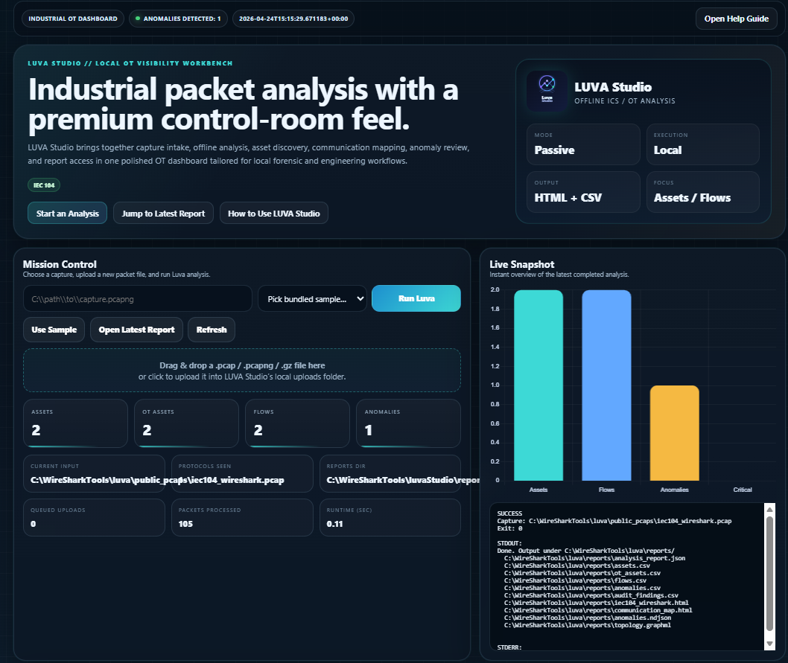
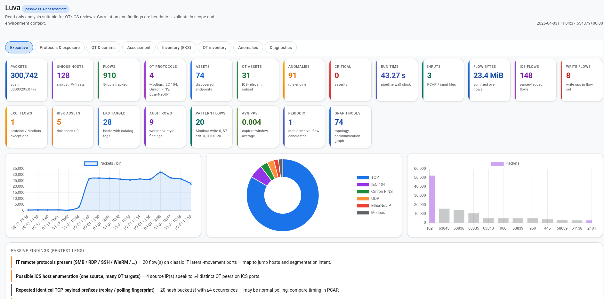
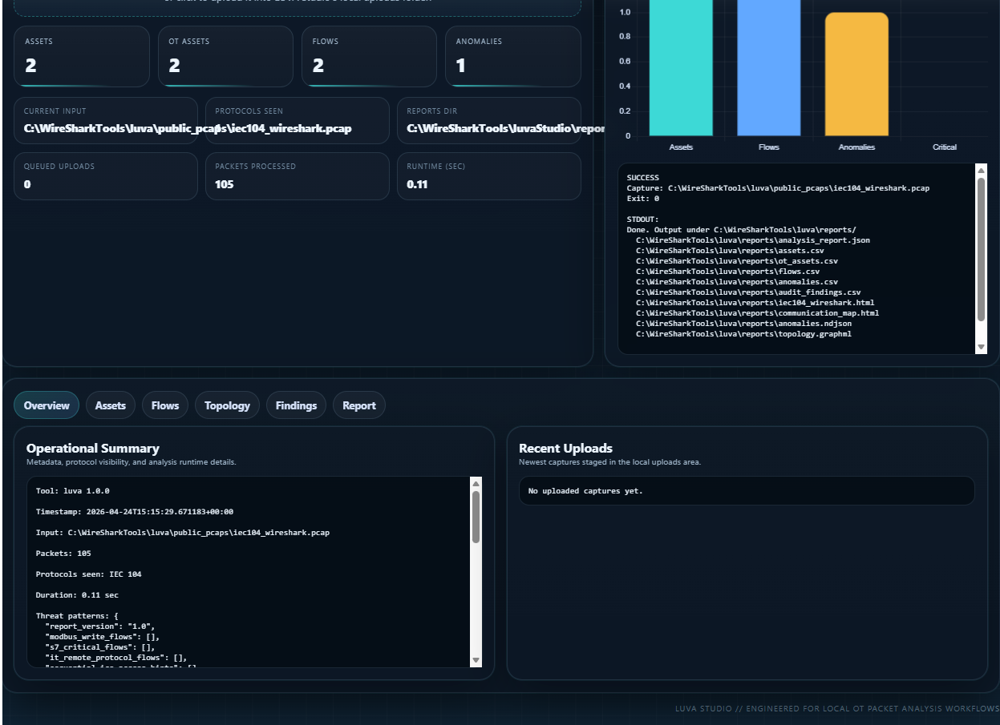
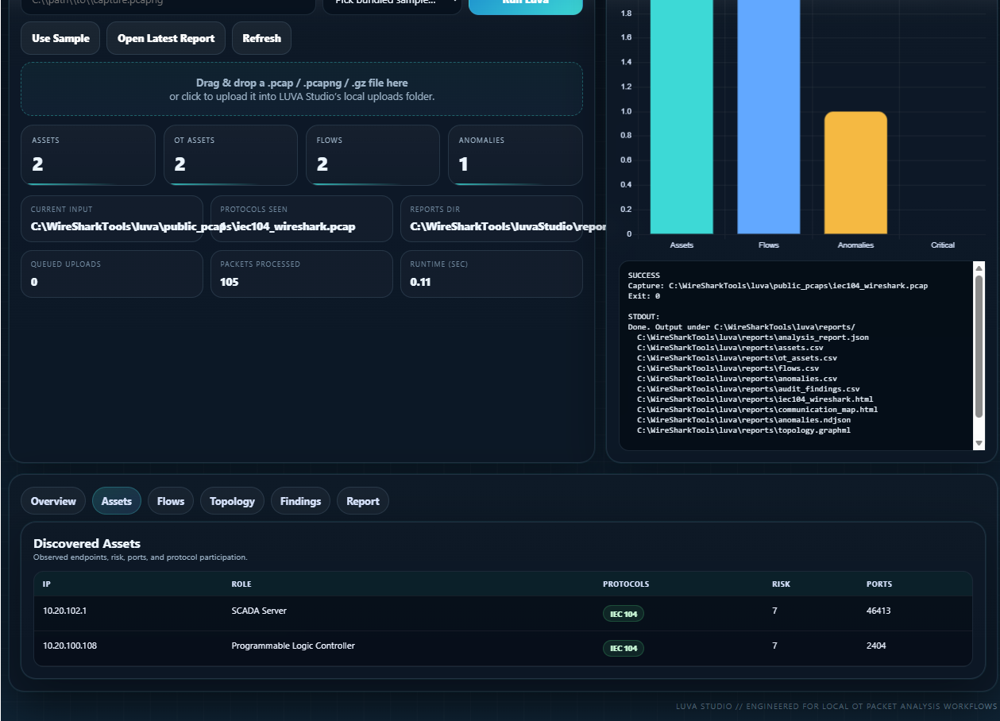
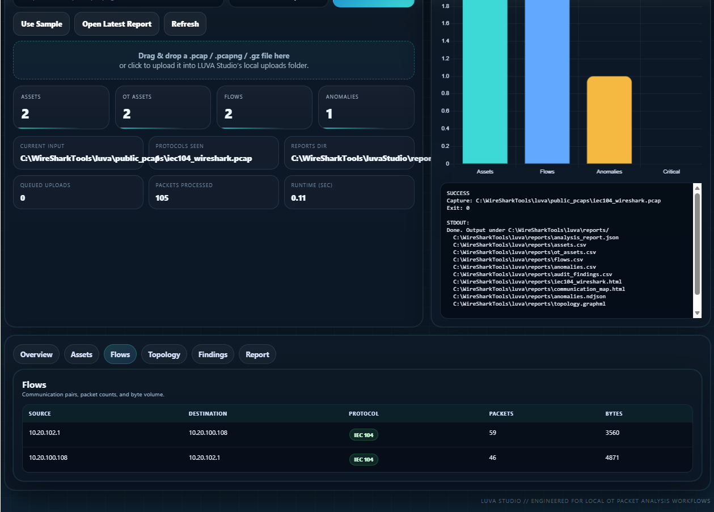
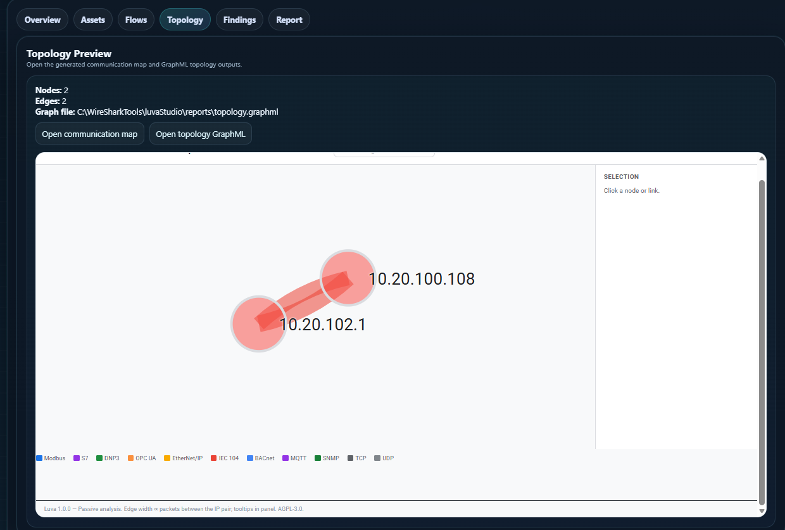
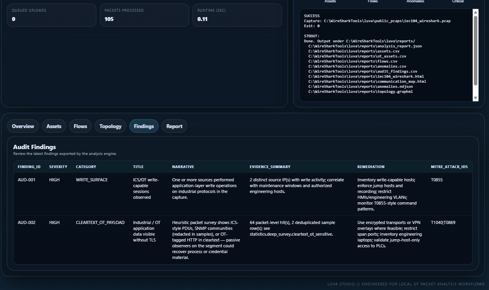
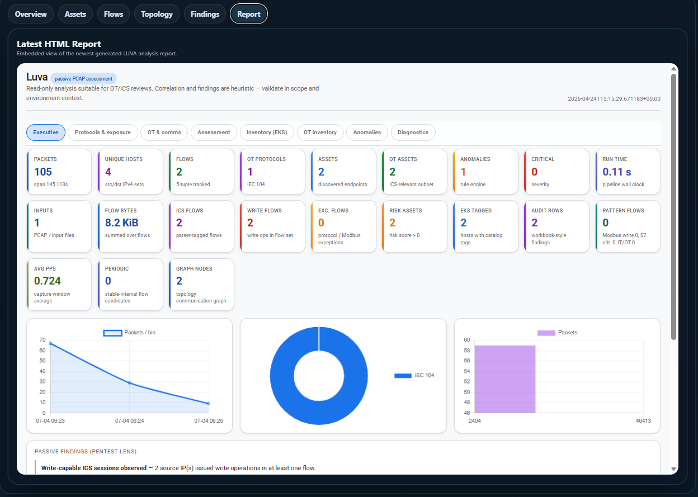

# LUVA Studio

  

  <strong>LUVA Studio</strong> is a passive offline analysis workspace for industrial control and SCADA packet captures.
  It reads capture files from disk only and turns them into a local dashboard with asset inventory, flow visibility,
  topology views, findings, and generated HTML reports.

---

## Overview

LUVA Studio is built for reviewing offline OT / ICS captures in a more polished desktop-friendly workflow.
Instead of starting from a raw command-line experience, you launch the local app, choose or upload a capture,
run analysis, and review the results from one interface.

The platform is designed around passive analysis only:

- no live sniffing
- no packet injection
- no interaction with the plant network
- no active scanning behavior

---

## Core capabilities

### Passive offline analysis

LUVA Studio processes:

- `.pcap`
- `.pcapng`
- `.gz`-wrapped capture files

It analyzes stored captures from disk and produces structured results for engineering, review, and investigation workflows.

### Asset discovery

LUVA Studio identifies endpoints and builds a usable view of the environment, including:

- IP and MAC visibility
- inferred device roles
- open ports
- protocol participation
- communication partners
- packet and byte context
- heuristic risk indicators

### Flow visibility

The platform builds communication views that help you inspect:

- source and destination relationships
- protocol usage
- packet counts
- byte counts
- ICS-related flow behavior

### Topology and communication mapping

LUVA Studio generates topology-oriented outputs that help visualize the environment:

- communication map HTML
- GraphML topology export
- embedded topology preview inside the local dashboard

### Findings and anomaly review

LUVA Studio surfaces findings for offline review through:

- findings tables in the GUI
- CSV exports
- HTML reporting
- protocol and traffic pattern summaries

### Reporting outputs

LUVA Studio can produce and display outputs such as:

- JSON analysis reports
- CSV exports
- HTML reports
- communication map HTML
- GraphML topology files

---

## Protocol coverage

LUVA Studio is designed to work with industrial traffic commonly found in OT and ICS environments.
Current built-in coverage includes support and visibility around protocols such as:

- Modbus/TCP
- S7comm
- DNP3
- OPC UA
- EtherNet/IP
- IEC 60870-5-104
- BACnet/IP
- MQTT
- SNMP
- Omron FINS
- GE SRTP

---

## LUVA Studio workflow

1. Launch `StartMe.bat`
2. The launcher checks Python and prepares the local environment
3. The LUVA Studio GUI opens in the browser
4. Choose a bundled sample capture or upload your own file
5. Click **Run Luva**
6. Review results in the tabs:
   - Overview
   - Assets
   - Flows
   - Topology
   - Findings
   - Report

---

## Screenshots

Below are the current LUVA Studio screenshots from the `img` folder, including the main window and each major tab view.

### Main dashboard

  

### Main dashboard alternate view

  

### Overview tab

  

### Assets tab

  

### Flows tab

  

### Topology tab

  

### Findings tab

  

### Report tab

  

---

## Typical output files

A completed run can generate files such as:

- `reports\analysis_report.json`
- `reports\assets.csv`
- `reports\flows.csv`
- `reports\audit_findings.csv`
- `reports\communication_map.html`
- `reports\topology.graphml`
- capture-specific HTML report files

---

## Repository layout

- `StartMe.bat` — Windows launcher
- `LuvaGuiServer.py` — local GUI web server
- `RunLuvaQuiet.py` — quiet analysis runner used by the GUI
- `webgui/` — local browser interface and help page
- `luva/` — analysis engine code
- `ot_baseline/` — baseline analysis components
- `public_pcaps/` — sample capture files
- `reports/` — generated outputs
- `img/` — logos and current LUVA Studio screenshots
- `artifacts/` — local helper outputs and logs

---

## Notes

- LUVA Studio is intended for local desktop use
- analysis is passive and file-based
- the GUI is designed to make OT / ICS capture review easier for offline workflows
- the built-in Help page is available from inside the GUI

---

## Project information

GitHub: github.com/Ayman-Elbanhawy/LuvaStudioio  
Website: SoftwareMile.com  
Support: Github@Softwaremile.com
